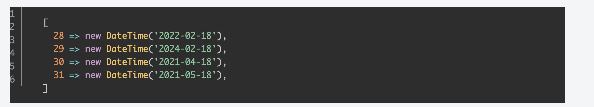
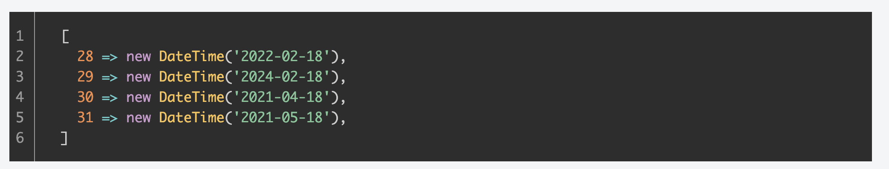

## これなに

コードブロックのテーマを付与しただけでは物足りなかったので行番号も付与してみます。


### 前提

Gatsbyのテーマは[Starter Blog](https://www.gatsbyjs.com/starters/gatsbyjs/gatsby-starter-blog)を利用しています。


## 行番号付与

行番号も付与します。 `gatsby-remark-prismjs` のオプションを設定していきます。

Before

```js:title=gatsby-config.js
    {
      resolve: `gatsby-transformer-remark`,
      options: {
        plugins: [
          /* ~略~ */
          `gatsby-remark-prismjs`,
```

After

```js:title=gatsby-config.js
    {
      resolve: `gatsby-transformer-remark`,
      options: {
        plugins: [
          /* ~略~ */
          {
            resolve: `gatsby-remark-prismjs`,
            options: {
              classPrefix: "language-",
              inlineCodeMarker: null,
              aliases: {},
              showLineNumbers: true,
              noInlineHighlight: false,
            },
          },
```

次にCSSを読み込みます。

```js:title=gatsby-browser.js
import "prismjs/plugins/line-numbers/prism-line-numbers.css" 
```

ここで問題なのが、行番号の表示がずれてしまっています。こりゃいかん。



CSSで調整します。今回はグローバルなCSSで当ててますがお好みでどうぞ。

```css:title=global.css
.line-numbers .line-numbers-rows {
    padding: 1rem 0 1rem 0.5rem;
}
```

グローバルCSSはこんな感じで読み込みました。

```js:title=gatsby-browser.js
import "./src/styles/global.css"
```

完成！なんとなくいい感じになった気がする



## 参考記事

- [GatsbyJSで作っているブログでシンタックスハイライトが適用されるようにした](https://kikunantoka.com/2019/12/03--install-syntax-highlight/)

## PR

- [シンタックスハイライト導入](https://github.com/sotaryoutarou/sotaryoutarou.github.io/pull/44)