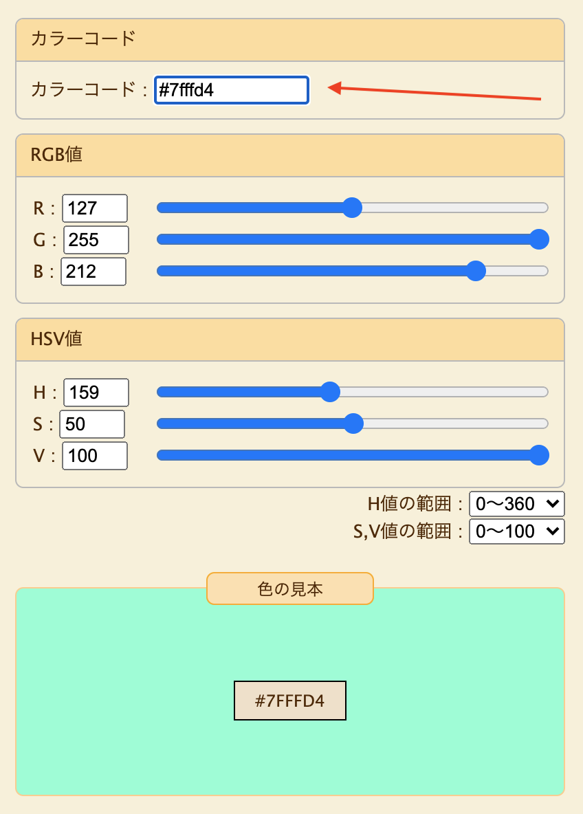
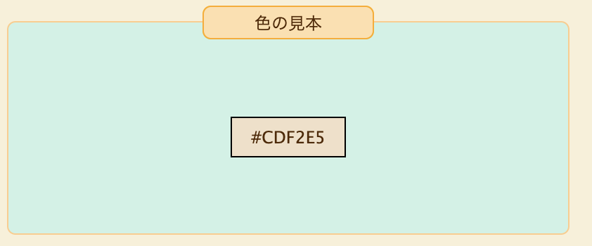

## なにこれ

デザインや色に詳しくないBEエンジニアが淡い系のお洒落なカラーコードを獲得できたので備忘録です。

LTやサムネ画像作り、ブログの作成などでお洒落なカラーコードが欲しいけどいまいちピンとこない時に読んでほしい記事です

このブログのサムネも毎回手動で作成しているのですが、一応淡いパステルカラー統一で被らないように選んでいます。初期はなかなかピンと来ることがなく時間がかかっていたのですが、やっと上手くなってきたので備忘録として残してみます。

## やること

以下のサイトを利用します。

- [WEB色見本 原色大辞典 - HTMLカラーコード](https://www.colordic.org/)
- [RGBとHSV・HSBの相互変換ツールと変換計算式 - PEKO STEP](https://www.peko-step.com/tool/hsvrgb.html)

### ①ベースになる色を原色大辞典から持ってくる

今回は原色大辞典から [#7fffd4](https://www.colordic.org/colorsample/1066) を例で用いてみる。

いい感じの色だけど、少し彩度が強いのでもう少し柔らかめな色にしたい。

### ②ベース色の彩度を調整する

[RGBとHSV・HSBの相互変換ツールと変換計算式 - PEKO STEP](https://www.peko-step.com/tool/hsvrgb.html)のサイトで彩度を調整する

Hを変更するとベース色が変わってしまうので、SとVを調整する

パレットを例えにすると、**Sで水を足してVで白/黒を足していくイメージ**

Sを下げると割と柔らかいパステルカラーに近づく印象。(Vを上げすぎるとぼやっとしてしまうので注意が必要)

1. `カラーコード` の入力欄に、ベース色のカラーコードを入力する
    - 
2. HSVを調整する、今回は以下のような調整にしたけどベースカラーをもとに臨機応変に
    - H: そのまま
    - S: 50→26
    - V: 100→95
    - こんな感じの色になる（カラーコードは `#7fffd4` から `#CDF2E5` になった）
        - 

## あとがき

デザイナーではないので正しいのかはよく分からないですが、HSVを押さえるとデザイン知識皆無でも無料でぽい色を獲得することができました。

彩度を上げればコーポレートカラーや差し色に使えそうな色も作れそうですね、よかったらご参考に〜
