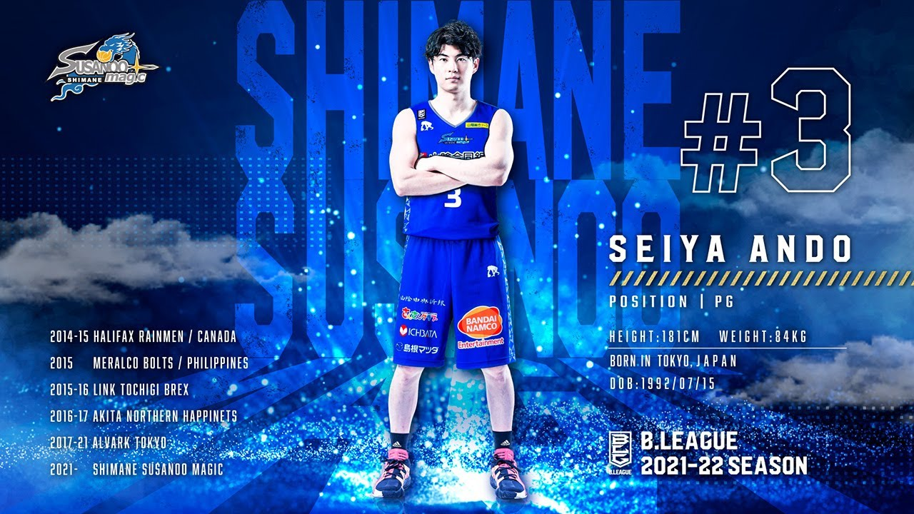

## なにこれ

Bリーグ開幕まで大体1ヶ月です！

ここまで開幕が待ち遠しかったことはないでしょう！

はやる気持ちを抑えきれずブログ記事を綴ってみます！

## ロスター

今年のロスターはこんな感じですね！大きくは昨シーズンと変わりないですが（すごいこと）代表選手がチラホラ見えますね。。。

| No | Name | Position |
| ------ | ---- | ---------- |
| 1 | 後藤 翔平 | SG |
| 2 | ぺリン・ビュフォード | SF |
| 3 | 安藤 誓哉 | PG |
| 4 | ニック・ケイ | PF/C |
| 5 | 山下 泰弘 | PG |
| 6 | 北川 弘 | PG |
| 8 | リード・トラビス | PF |
| 13 | 阿部 諒 | SG |
| 14 | 金丸 晃輔 | SG/SF |
| 15 | 白濱 僚祐 | SG/SF |
| 22 | 小阪 彰久 | PF |
| 28 | ウィリアムス ニカ | C |

### 移籍について

杉浦/ブルックス/神里が退団し、金丸/安藤/ケイが加入しました。

ポジション別にみると、

- 神里→安藤
- 杉浦→金丸
- ブルックス→ケイ

のような変化がありました。まさに補強ですね！！

ただ、杉浦の方がサイズがあってリバウンドにはアドバンテージがあったり、ビュフォード→ブルックスの超速ハイローが見れなくなったり、失ったものも確かにあるのでどう補っていくか注目です！

### ヘッドコーチについて

前香川HCのポールヘナレさんが今シーズン島根を率いてくれます。ニュージーランド代表のHCを務めた経歴もあり、国際的な経験もあるコーチです。

香川ではトランジションと5アウトオフェンスがメインの戦術のようで、島根お得意のトランジションに5アウトオフェンスをどう組み合わせていくのか注目ですね！個人的にオフェンス面ではニカと金丸がキーマンになりそうな気がします。

## スタメン予想してみる

✨*無難バージョン*

- 1st 安藤/金丸/白濱/トラビス/ケイ
- 2nd 北川/阿部/ビュフォード/ニカ
- 3rd 山下/後藤/小坂

一番オーソドックスな構成だと思います。1stユニットでは金丸中心のセットオフェンス、2ndユニットはビュフォードのペイントアタックからのキックアウトor自分で決める。といった強力なファーストオプションが2度楽しめますね。

💨*攻めバージョン*

- 1st ビュフォード/阿部/金丸/ケイ/ニカ
- 2nd 安藤/北川/白濱/トラビス
- 3rd 山下/後藤/小坂

今シーズンは多くのチームが帰化枠/アジア枠を取っているので、スターターのサイズアップが予想されます。そこに対抗するためにon3スタートもありかなと。安藤/トラビスをシックスマンで起用するのも面白そうですよね。

## 今シーズン気になる選手

### ビュフォード

昨季の島根の中心選手です。特にトラビス帰国後に8連勝に導いた活躍は本当にハンパなく、ベスト5に入る実力はあるように感じています。今シーズンはビュフォードが牽引できればCSも夢ではない反面、ちょっと空回るようだったら難しい気がしています。強力なメンバーが加入しましたが、なんだかんだビュフォードの出来に左右されるのではないかと思っています！

### ケイ

オリンピック銅メダリストが島根にやってきました！！何度も部活で通った鹿島体育館でオリンピック銅メダリストが練習していると思うと胸熱です！

外からも打てて献身的なプレイで周りを引き立てることもできるのでチームとしての幅が広がることが期待できますね！

### 安藤

優勝経験もあるアルバルク東京のエースPGが島根に来てくれました！

島根に一番足りない勝者のメンタリティーを持つプレイヤーが加入したということで、シーズンの戦い方やチーム状況が悪いタイミングで打破する力もあると思います！期待！！！

### 小阪

なんだかんだキーマンだと思っています。。！！

ニカがファウルトラブルでゲーム終盤に不在になったり、杉浦が抜けたことでゲーム終盤、日本人選手の長身プレイヤーが手薄になっている状況です。

昨シーズン悩まされた膝を治したので覚醒してくれることに期待！！頑張れ〜！！

## 気になるチーム（西地区）

### 🏝琉球

コーフリッピン、ヒューくん、小寺、アレンが加入しましたね。。今年も西地区優勝筆頭の大戦力といって良いでしょう！（去年より強い気がする。。）

CS出場を目指すに当たって星を吸われないことが重要なポイントになってくる気がします。少なくとも1勝3敗、イーブンで終えられたら御の字ではないでしょうか。

### 🐻富山

今年もマブンガ・宇都のゲームメイクからの、スミスのラインが軸になってくると思います。

去年と違うところとしては、松脇・岡田・前田の若手三銃士が移籍して松井KJ・小野龍猛といったベテラン選手が加入しました。ただ、PTの制限があるため去年よりパワーダウンが予想されます。

昨シーズンは1勝もできなかった相手だけに、今シーズンは勝ち越しを期待したいところです！

### 🍁広島

島根と同じく今シーズンに大補強を行ったチームです。ジャクソン/メイヨ/辻/寺嶋/マーフィー あたりが中心になってきそうです。チームケミストリーが出来上がっていない中どこまでやれるか、正直予想できないですが。。。bjリーグ時代からのライバルチームなだけに今シーズンも勝ち越したいですね！

### 🐙大阪

移籍してきた竹内、攻撃力の高いニュービス、身体能力の高いアイラブラウン、日本国籍持ちのザックムーア、ジョセフといった国際色強いチームです。高さもかなりありCS出場を争うチーム筆頭です。

## 順位予想

ブースター補正ありでこんな感じになると予想しています。ワイルドカードか3位争いでCS出場ができれば！！

1. 🏝琉球

2. 🐬名古屋

3. 🐙大阪

4. 🐉**島根**

5. 🏇三河

6. 🍁広島

7. 🧸富山

8. 🐥三遠

9. 💧滋賀

10. ⛰信州

11. ⛩京都

## あとがき

毎回恒例で後半力尽きました！ライバルチームも強いが島根も強い！

変化の大きいシーズンですが今シーズンも楽しんでいきましょう！！！٩(๑❛ᴗ❛๑)۶