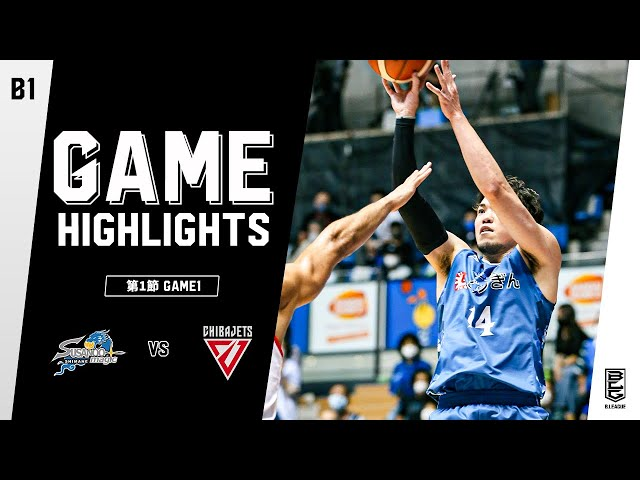
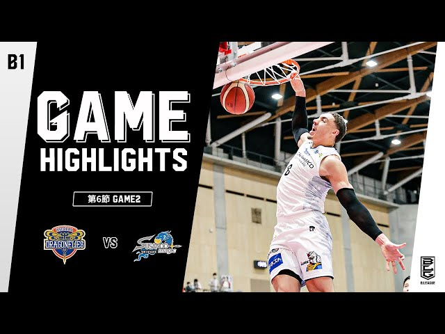
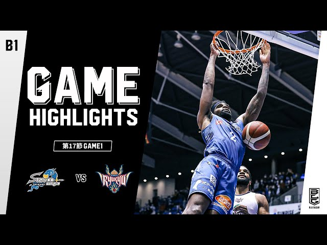
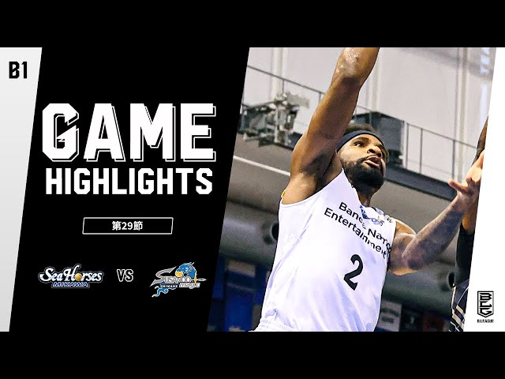

## ナニコレ

恒例になりつつある、シーズン終了して大体余韻が冷めた約1ヶ月後に振り返るやつ

そして尻すぼみ

## 総括

言葉で表せないくらい最高なシーズンだったと思います

超田舎な町にホームを置くチームが、ド派手なゲーム展開で関東の強豪を倒していく姿はこの10年間島根ブースターが夢に見ていた景色だったのではないでしょうか、もしくはそれ以上かもしれません

2年前の島根ブースターに「2年後アルバルク東京とCSのQFで戦ってセミファイナルに進みます、相手は琉球です」って言っても冗談にすらならなかった

### 未来の松江市長、安藤誓哉

シーズン開始前、メディア取材で彼は「優勝を目指します、ブースターの皆さん覚悟を持って下さい」と言いました。
それまで降格争い、昇格争いを経験してB1自体にステータスを感じていた島根ブースターは「優勝???覚悟??ﾅﾆｽﾙﾉｿﾚ….??」といった反応だったと思います。

若者は県外に出る、遊ぶところは無い、都会へのコンプレックス、染み付いた負け癖、どこか諦めた街の雰囲気、けど居心地はいい

安藤はそんな街の島根ブースターを勝負の舞台に叩き上げてくれたと思っています

## 個人的お気に入りの試合

40勝もした今シーズンのゲームの中で、印象深かったものをピックアップ

（画像をクリックでYouTubeへ飛べます）

###  VS 🥜千葉 GAME1

　

〜開幕前〜

Bリーグ「島根さん、開幕戦は昨シーズン優勝の千葉ジェッツです、島根ホームです、Bリーグ盛り上げてください」

島根「ええっ。。。」

〜蓋を開けてみると〜

島根「うわあああああぁぁぁぁぁっ」

千葉「うわあああああぁぁぁぁぁぁぁぁぁぁぁ！！！」

島根「うわあああああぁぁぁぁぁぁぁぁぁぁぁぁぁぁぁぁ安藤！！！！」

という感じで終始ノーガードの殴り合いの末100-94の100点ゲームで千葉に殴り勝ちました。

Bリーグに突きつけた強烈なアンサー、痺れました

千葉もトランジションチームですが、終盤千葉の多くの選手が膝に手をついたりコートに倒れるシーンが多くなっていたのが印象的でした

### VS 🍁広島 GAME2

　

島根が大勝したGAME1とは対象に強烈なカムバックを果たした広島

GAME1ではペース落としてディフェンス重視というゲームプランっぽかったのですが、終始島根ペースで試合が進んでいきました

GAME2では個人技とトランジションで殴り勝つプランでリズムが生まれました

試合は96-96で決着が着かずOTに突入、勝敗を分けたのは残り50秒1点ビハインド、TOになりそうな局面をギリギリで凌ぎながらメイクした金丸のオープンスリーでした。

（そしてニックケイが45分フル出場、この辺りから鉄人伝説は始まります）

### VS🏝 琉球 GAME1

　

琉球のB1記録、20連勝を止めたゲーム

序盤から並里に永遠とミドルを打たせて、琉球のストロングポイントであるハイレベルなチームオフェンスの機能を奪うことに成功

トラビスと金丸が不在の大ピンチな状況で

ビュフォード「ギア・・セカンド！！ﾄﾞﾝｯ!!」

### VS 🏇三河 GAME4

　

終始三河ペースで試合が進み食らいつく展開

残り30秒で5点差、スリーが1本は必要、オフェンス失敗したら詰む

この状況で古巣との対戦に静かに燃える金丸先生がやってくれました

金丸がスリーをねじ込み、三河のオフェンスを凌ぎ、残り数秒ビュフォードの個人技で同点

OTでは安藤がディープスリーを2本決め流れをたぐり寄せて勝利

負け試合になってもおかしくない試合をなんとか拾い、CSに向けてめちゃくちゃデカい勝利でした

### VS 🚗東京 CS QF

　

安藤の恩返し

- QFの中で唯一GAME3までもつれ込む緊迫した展開
- 序盤から安藤が爆発、序盤から1on1で得点を重ねる
    - 相手（東京）ベンチを煽る煽る
    - 会場も煽る煽る
- 個人的今シーズンのNo.1ハイライト、3Q終わりにトラビスの3連続3P
- 松江が揺れた

## ざっくり対戦チーム毎の振り返り

西から行きます

### 🏝琉球

- **1勝5敗**
- 20連敗を止めた次の試合からCSまで5連敗を喫してしまいます
- トラビス不在の試合が多く島根が一番欲しかったインサイドでのスピード的優位が持てなかった
- CSではリードしている時間は島根の方が長かったけど、最後までDF強度の落ちなかった琉球
    - 沖縄アリーナは本当にすごい、島根にも欲しい

| Date        | Score   | W/L  |
| ----------- | ------- | ---- |
| 3/11（金） | 87 - 76 | W  |
| 3/12（日） | 74 - 92 | L    |
| 4/23（土） | 82 - 92 | L    |
| 4/24（日） | 68 - 71 | L    |
| 👑5/21（土） | 85 - 94 | L    |
| 👑5/22（日） | 70 - 72 | L    |

### 🍁 広島

- **3勝1敗**
- ライバル広島に勝ち越し
- 2節とも島根快勝→広島カムバックの流れ
- 4/10は寺嶋にキャリアハイをかまされ敗北
    - 3Pの精度が高く守りにくそうだった

| Date        | Score   | W/L  |
| ----------- | ------- | ---- |
| 11/6（土）   | 81 - 102 | W    |
| 11/7（日）   | 109 - 113 | W    |
| 4/9（土） | 89 - 67 | W    |
| 4/10（日） | 84 - 91 | L    |

### ⛩京都

- **2勝1敗**
- 実は3勝したかった相手
- シーズン最終戦でもあった5/8のゲームは京都が積極的でハイリスクなプレーを立て続けに決めてた印象、画面越しでも気迫が伝わった

| Date        | Score   | W/L  |
| ----------- | ------- | ---- |
| 10/27（水）   | 100 - 66 | W    |
| 3/9（水）  | 95 - 74 | W    |
| 5/8（日） | 79 - 82 | L    |

### 🐙大阪

- **2勝2敗**
- 負けた試合は理不尽シュートを入れられまくってリズムを崩した
    - ニュービルがヤバすぎる、怪獣
    - 特指の高嶋くん、3P入れすぎ
- 高さとフィジカルで勝負する大阪は3Pが入ると島根は対応が難しい

| Date        | Score   | W/L  |
| ----------- | ------- | ---- |
| 10/16（土）   | 88 - 77 | W    |
| 10/17（日）  | 77 - 92 | L    |
| 3/5（土） | 77 - 69 | W   |
| 3/6（日） | 85 - 68 | L    |

### 💧滋賀

- **4勝0敗**
- ペースがめちゃくちゃ早い滋賀との対戦
- フィリピンからの刺客、キーファー・ラベナが身体能力生かしたペイントアタックをしてきたのが印象的
- ディフェンスが良くないのでかなり点は取れていた
- 面白い補強をしたので来季が楽しみ

| Date        | Score   | W/L  |
| ----------- | ------- | ---- |
| 11/10（水） | 102 - 94 |  W   |
| 3/16（水） | 82 - 74 |  W   |
| 4/29（金）| 97 - 56 |  W   |
| 4/30（土） | 102 - 79 |  W   |

### 🐬 名古屋

- **2勝2敗**
- 島根と似たようなスタイルの名古屋
- 身体能力高いウィングが優秀すぎる
- そして曲者PGの斎藤たくみんが嫌なところでスクープショットや3Pを沈めてくる
- インサイド陣も走る走る
- オフェンスのチームって聞いてたけどディフェンス本当に固い

| Date        | Score   | W/L  |
| ----------- | ------- | ---- |
| 12/4（土）   | 73 - 82 | L    |
| 12/5（日）  | 94 - 86 | W    |
| 1/2（日） | 76 - 91 | L    |
| 1/3（月） | 88 - 81 | W    |

### 🏇三河

- **4勝0敗**
- 金丸先生の古巣
- 日本の未来を背負うスター選手がポンポン出てくるあたり育成が本当に上手いなと🍢
- どのゲームか忘れちゃいましたがケイがシェーファーを完全に抑えてリバウンドを1本も取らせなかったのが圧巻でした

| Date        | Score   | W/L  |
| ----------- | ------- | ---- |
| 12/29（水）  | 92 - 78 |  W  |
| 2/5（土）    | 86 - 82 |  W  |
| 2/6（日）    | 95 - 78 |  W   |
| 4/6（水）    | 90 - 84 |  W  |

### 🐤三遠

- **4勝0敗**
- 監督解任があったり大型連敗があったりで順調なシーズンではなかった三遠
- ポテンシャルの高い選手が多いけどチームプレイが成熟していない印象
- 終始危なげない試合運びで快勝
- コロナの影響で3連戦という謎スケジュールが発生

| Date        | Score   | W/L  |
| ----------- | ------- | ---- |
| 3/23（水） | 91 - 65 |  W  |
| 3/26（土） | 87 - 71 |  W  |
| 3/27（日） | 88 - 80 |  W  |
| 4/20（水） | 92 - 81 |  W  |

### ⛰信州

- **2勝0敗**
- コロナや怪我人で8人しか試合に出れてなかった気がする
- ヤンジェミンが覚醒
- 2試合目の終盤まで競ったファイトバックは本当に凄かった
- 岡田くんいたら結果変わってたと思う

| Date        | Score   | W/L  |
| ----------- | ------- | ---- |
| 12/18（土） | 91 - 71 |  W   |
| 12/19（日） | 75 - 67 |  W   |

### 🐻富山

- **4勝0敗**
- 一番最初のゲームは天皇杯だったと思う
    - 結果的にいうとスミスへの対応が確立したのと、負けたことでゲーム数が減ったのはチームとしてラッキーだった
    - 3Qまで競るけど終盤ファールトラブルに追い込んで流れを掴む流れになったゲームが多かったと思う
    - ニカが仕事した

| Date        | Score   | W/L  |
| ----------- | ------- | ---- |
| 2/2（水） | 91 - 75 |  W   |
| 3/19（土） | 79 - 75 | W   |
| 3/20（日） | 87 - 76 |  W   |
| 4/27（水） | 87 - 80 |  W   |

### 🌾新潟

- **2勝0敗**
- 危なげないゲーム運びで2勝！
- ベンチメンバーでも安定した試合運びができると良いのだけど・・・

| Date        | Score   | W/L  |
| ----------- | ------- | ---- |
| 12/15（水） | 90 - 59 |  W  |
| 3/23（水）| 77 - 62  | W    |

### ⚡️ 川崎

- **0勝0敗**
- シーズン終盤のビッグマッチだったのにコロナで吹っ飛んだ、コロナきもい！！！

### ⚓️横浜

- **1勝1敗**
- なんかbj時代から勝ち越した思い出がない横浜
- 来シーズンのホーム開幕では河村やっつけて2連勝を期待！

| Date        | Score   | W/L  |
| ----------- | ------- | ---- |
| 10/23（土） | 80 - 83 |  L   |
| 10/24（日） | 95 - 89 |  W   |

### 🌞渋谷

- **2勝0敗**
- 米子の試合だった気がする
- トラビスのとんでもアリウープ
- 白濱の鬼ディフェンスでベンドラメを抑えたのが効いた
    - 白濱はバズソーの裏番長だよね

| Date        | Score   | W/L  |
| ----------- | ------- | ---- |
| 1/29（土） | 109 - 77 |  W   |
| 1/30（日） | 83 - 79 |  L   |

### 🚗東京

- **3勝2敗**
- ウィ〜！！今シーズンを語る上で一番のチームA東京
- まさかアルバルクに島根が勝つ時が来るとは・・・しかもCSで・・・

| Date        | Score   | W/L  |
| ----------- | ------- | ---- |
| 11/13（土） | 79 - 66 |  W   |
| 11/14（日） | 61 - 64 |  L   |
| 👑5/14（土） | 80 - 63 |  W   |
| 👑5/15（日） | 57 - 91 |  L   |
| 👑5/16（月） | 80 - 62 |  W   |

### 🥟宇都宮

- **1勝1敗**
- 鵤と比江島不在
- 2連勝したかったけどベンチメンバーも強いね・・
- 荒谷すごい、島根にも欲しい

| Date        | Score   | W/L  |
| ----------- | ------- | ---- |
| 12/25（土） | 81 - 64 |  W   |
| 12/26（日） | 70 - 95 |  L   |

### 🥜千葉

- **勝敗**
- 100点ゲームでブチ破った開幕戦の興奮
- GAME2は完全に安藤を潰されてしまって修正力の高さを見せつけられた

| Date        | Score   | W/L  |
| ----------- | ------- | ---- |
| 10/2（土） | 100 - 94 |  W   |
| 10/3（日） | 74 - 81 |  L   |

### 👹秋田

- **0勝0敗**
- 試合な〜し！
- CSで対戦できたら同期bjチーム対決で熱かったんだけど持ち越し

### 🐄北海道

- **1勝1敗**
- 去年島根でプレーしたブルックス率いる北海道
- 千葉の次の節
- 2試合ともチームがスタイルを模索してる感じだった

| Date        | Score   | W/L  |
| ----------- | ------- | ---- |
| 10/9（土） | 87 - 84 |  W   |
| 10/10（日） | 94 - 79 |  W   |

## あとがき

スサノオマジック 最高すぎる！！